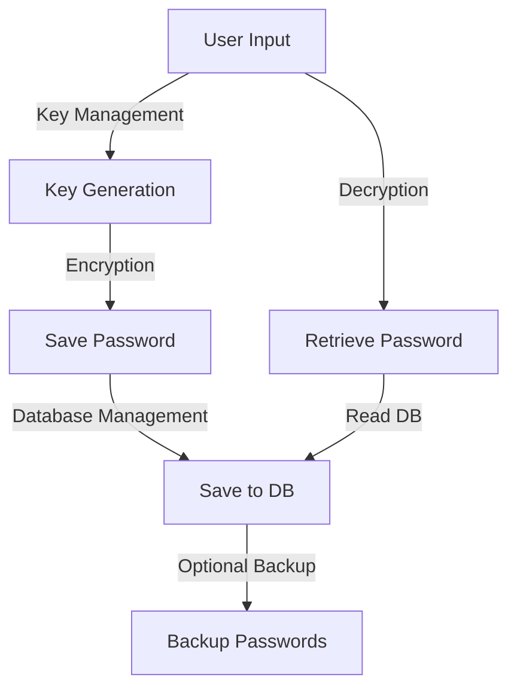

# Passwd-Manag

**A secure and user-friendly password management tool for managing and encrypting passwords effortlessly.**

---

## 🔑 Features at a Glance

- **Secure Encryption**: Uses the `cryptography.fernet` module for password encryption and decryption.
- **Automatic Password Generation**: Generate secure passwords with customizable options.
- **Domain Management**: Save, retrieve, list, and delete password entries associated with specific domains.
- **Backup System**: Create backups of your stored passwords.
- **Simple Key Management**: Easily create and archive encryption keys for secure password management.

---

## 🏗️ Visual Overview



---

## 🚀 Installation and Setup

### Prerequisites
- Python 3.8 or higher
- Virtual environment (recommended)

### Step 1: Clone the Repository
```bash
git clone https://github.com/Caio-Felice-Cunha/Passwd-Manag.git
cd Passwd-Manag
```

### Step 2: Install Dependencies
```bash
pip install -r requirements.txt
```

### Step 3: Run the Password Manager
```bash
python template.py
```

---

## Usage Guide

1. Launch the application using `python template.py`.
2. Follow the on-screen menu to:
   - **Save a New Password**: Encrypt and save a password for a specific domain.
   - **Retrieve a Password**: Decrypt and display stored passwords.
   - **List All Domains**: View all saved domains in your password manager.
   - **Delete a Password**: Remove an entry by domain.
   - **Create a Backup**: Save all passwords to a secure backup file.

---

## 🤝 Contribution Guide

### Development Environment Setup
1. Fork the repository and clone it:
   ```bash
   git clone https://github.com/your-username/Passwd-Manag.git
   cd Passwd-Manag
   ```
2. Create a virtual environment:
   ```bash
   python -m venv venv
   source venv/bin/activate  # On Windows, use `venv\Scripts\activate`
   ```
3. Install dependencies:
   ```bash
   pip install -r requirements.txt
   ```

### Submitting Changes
1. Ensure your code follows the repository's style and passes tests.
2. Push changes to your fork and create a pull request.
3. Include a detailed description of your changes and their purpose.

---

## 🚧 Known Issues and Future Plans

### Known Issues
- **Invalid Key Handling**: The application doesn't currently enforce robust key validation.
- **User Experience**: Error messages could be made more user-friendly.

### Future Plans
- **Cross-Platform GUI**: Build a graphical interface for broader accessibility.
- **Cloud Synchronization**: Enable secure cloud-based backups.
- **Advanced Password Analysis**: Add features to analyze the strength of existing passwords.

---

## 📝 License

This project is licensed under the MIT License. See the `LICENSE` file for more details.

---

## 🎯 Credits
This project was developed as part of the "4 days 4 projects" initiative by [Pythonando](https://pythonando.com.br) on YouTube.